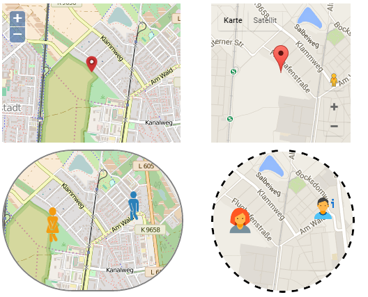

ioBroker.vis-map
============

Widgets, that can show coordinates on a map. 
Actually supported only Open Stree Maps and Google. To use Google Maps you should get the API Key for google maps.
You can get it [here](https://console.developers.google.com/flows/enableapi?apiid=maps_backend,geocoding_backend,directions_backend,distance_matrix_backend,elevation_backend&keyType=CLIENT_SIDE&reusekey=true)

## Changelog

### 0.1.1 (2016-07-17)
- (bluefox) remove unused files

### 0.1.0 (2016-07-08)
- (bluefox) initial checkin

## License
 Copyright (c) 2016 bluefox
 MIT
